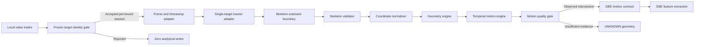
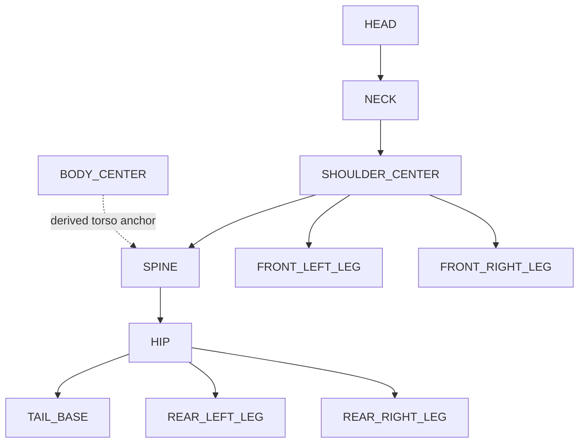

# Guardian Motion Layer Architecture

Project: G3-A Guardian Motion Layer

Status: ARCHITECTURE PROPOSED — IMPLEMENTATION NOT PERFORMED

Scope authority: the milestone authorizes the project but explicitly states `NO IMPLEMENTATION`. This document therefore defines architecture and implementation-ready contracts only. It does not add a pose model, runtime module, dependency, storage migration, UI, cloud inference, or production code.

## 1. Purpose and boundary

Guardian Motion Layer converts an already authorized, pet-bound local video stream into deterministic motion geometry:

```text
Video → Skeleton → Geometry → Temporal Motion → GBE
```

It describes how the body appears to move. It must never explain why it moves or emit diagnosis, disease prediction, medical interpretation, fatigue score, health score, treatment advice, or user-facing conclusions.

The Motion Layer is shared by dogs and cats. A species label may be retained as metadata for future downstream interpretation, but it must not select a different skeleton engine or change geometric meaning.

## 2. Architecture



### Module responsibilities

| Module | Responsibility | Explicit non-responsibility |
|---|---|---|
| Frame and timestamp adapter | Produce ordered local frames and monotonic timestamps | No geometry or interpretation |
| Single-target tracker adapter | Maintain the identity-bound target and visibility metadata | No cross-pet recovery or identity override |
| Skeleton estimator boundary | Supply candidate 2D landmarks through a replaceable local adapter | No vendor is selected in G3-A |
| Skeleton validator | Enforce topology, range, confidence, left/right consistency, and missingness | Never invent missing landmarks |
| Coordinate normalizer | Convert frame coordinates to normalized image and body-local coordinates | No camera-distance claim |
| Geometry engine | Derive frame-level vectors, ratios, angles, and relative positions | No medical semantics |
| Temporal motion engine | Derive time-aware changes, continuity, cycles, and sequences | No diagnosis or behavior interpretation |
| Motion quality gate | Suppress unsupported geometry and propagate `UNKNOWN` | No score presented to users |
| GBE contract adapter | Export a versioned, pet-isolated geometry envelope | No direct Timeline or Trend write |

## 3. Identity, isolation, and write boundary

The frozen GBE identity rule remains upstream and unchanged:

- `MATCH`: Motion Layer may run.
- `LOW_CONFIDENCE`: Motion Layer may run only after valid session-bound owner confirmation.
- `MULTIPLE_PETS`, `UNKNOWN`, or `MISMATCH`: Motion Layer must not run.
- Mid-session identity switching: abort the Motion Layer result.

Every request and output is bound to `petId`, `videoId`, `analysisRunId`, and `identityReceiptId`. The layer rejects a mismatch between those bindings. It cannot substitute a pet, reuse another pet's skeleton, or merge geometry across pets.

Motion Layer itself performs no baseline, Observation, Trend, or Timeline writes. GBE decides persistence after its existing quality and transaction rules. An identity rejection or aborted identity switch remains zero-write.

## 4. Coordinate systems

### 4.1 Image-normalized coordinates

For frame width `W` and height `H`, a valid pixel point `(px, py)` becomes:

```text
x = px / W
y = py / H
```

- origin: top-left;
- positive x: image-right;
- positive y: image-down;
- nominal range: `[0, 1]` for both axes;
- coordinates outside the frame are invalid, not clamped into a fabricated point.

### 4.2 Body-local coordinates

When shoulder center `S` and hip `H` are observed:

```text
origin = bodyCenter
forwardAxis = normalize(S - H)
lateralAxis = perpendicular(forwardAxis)
scale = distance(S, H)
```

A point `P` is transformed to:

```text
bodyX = dot(P - origin, forwardAxis) / scale
bodyY = dot(P - origin, lateralAxis) / scale
```

If the axis or scale is unavailable, degenerate, or below confidence, all dependent body-local geometry is `UNKNOWN`. No fallback constant substitutes for missing scale.

### 4.3 Anatomical left and right

`LEFT` and `RIGHT` mean the pet's anatomical sides, never screen-left and screen-right. When the estimator cannot resolve anatomical side consistently, both side-dependent outputs become `UNKNOWN`. The engine must not silently swap labels when the pet turns.

## 5. Shared skeleton model

Schema version: proposed `guardian-motion-skeleton-v1`.

### 5.1 Required landmark vocabulary

| Key | Meaning |
|---|---|
| `HEAD` | Stable head-region anchor |
| `NECK` | Neck/body junction anchor |
| `SHOULDER_CENTER` | Midpoint of visible shoulder structure |
| `SPINE` | Central torso anchor |
| `HIP` | Pelvic center anchor |
| `FRONT_LEFT_LEG` | Anatomical front-left limb anchor |
| `FRONT_RIGHT_LEG` | Anatomical front-right limb anchor |
| `REAR_LEFT_LEG` | Anatomical rear-left limb anchor |
| `REAR_RIGHT_LEG` | Anatomical rear-right limb anchor |
| `TAIL_BASE` | Tail/body junction anchor |
| `BODY_CENTER` | Validated torso center |

`BODY_BOUNDING_BOX`, `BODY_LENGTH`, and `BODY_HEIGHT` are skeleton-level measurements rather than point landmarks.

The minimal leg landmark is a coarse limb anchor. It is not equivalent to shoulder, elbow, wrist, hip joint, knee, ankle, or paw. True joint angles are therefore `UNKNOWN` in the minimum skeleton unless a future schema explicitly adds the required joint triplet.

### 5.2 Topology



Topology describes geometric relationships only. It is not an anatomical or medical model.

### 5.3 Landmark state

Every landmark has one state:

- `OBSERVED`: coordinate supported by current-frame evidence;
- `OCCLUDED`: expected from the tracked target but not visible enough for direct geometry;
- `OUT_OF_FRAME`: target region lies outside the frame;
- `UNKNOWN`: unavailable, ambiguous, invalid, or insufficiently confident.

`OCCLUDED`, `OUT_OF_FRAME`, and `UNKNOWN` carry null coordinates. Long gaps are never interpolated. A short-gap estimate, if a future milestone authorizes one, must be separately labeled `ESTIMATED`; it cannot be represented as `OBSERVED`.

### 5.4 Skeleton frame contract

Each skeleton frame contains:

- monotonically increasing `timestampMs`;
- `frameIndex`;
- pet/session bindings;
- all required landmark keys;
- per-landmark state, normalized coordinate, confidence, visibility, and occlusion;
- normalized body bounding box;
- body length and height with availability and confidence;
- tracking confidence and continuity;
- skeleton schema and estimator version.

Confidence is technical confidence only and ranges from `0` to `1`. It is never a health score.

## 6. Geometry engine

Geometry policy version: proposed `guardian-motion-geometry-v1`.

### 6.1 Frame-level outputs

| Output | Definition | Required evidence |
|---|---|---|
| `bodyAxis` | Unit vector from hip toward shoulder center | Hip and shoulder center |
| `bodyHeading` | Forward image-plane direction corroborated by neck/head | Body axis plus neck or head |
| `bodyRotation` | Wrapped image-plane angle `atan2(axisY, axisX)` | Valid body axis |
| `centerPosition` | Image-normalized body center | Observed or defensibly derived body center |
| `relativeBodyOrientation` | Body rotation relative to a declared frame reference | Valid body rotation and reference |
| `bodyHeightRatio` | Body height divided by body length | Positive body length and height |
| `bodyLengthRatio` | Body length divided by bounding-box diagonal | Positive measurements |
| `relativeLimbExtension` | Limb-anchor distance from attachment proxy divided by body-axis scale | Limb anchor, attachment proxy, positive scale |
| `relativeLimbCompression` | Bounded inverse relation defined by the same versioned limb-extension policy | Same evidence as extension |
| `jointGeometry` | Angle from an explicit three-landmark joint definition | Not supported by minimum skeleton; output `UNKNOWN` |

All angles use radians internally. Serialized angles use the closed-open interval `[-π, π)`. Angular differences use wrap-safe subtraction. Ratios must name their denominator and become `UNKNOWN` when it is zero or unreliable.

### 6.2 Confidence propagation

For a derived value, confidence cannot exceed its least-confident required input. The proposed default is:

```text
derivedConfidence = min(required landmark confidences)
                    × visibilityFactor
                    × trackingContinuityFactor
                    × geometryValidityFactor
```

All factors are clamped to `[0, 1]`. Thresholds remain versioned and pending implementation evidence. If confidence is below the relevant geometry threshold, availability is `UNKNOWN` and value is null.

### 6.3 Validation invariants

- no non-finite number;
- no coordinate outside the declared coordinate system;
- no negative length, duration, or scale;
- no ratio computed from a missing or zero denominator;
- no limb geometry when anatomical side is ambiguous;
- no angle from fewer than the required landmarks;
- no replacement of `UNKNOWN` with zero;
- no cross-frame geometry unless timestamps are monotonic.

## 7. Temporal Motion Engine

Temporal policy version: proposed `guardian-motion-temporal-v1`.

Temporal calculations use elapsed time, not assumed frame count. A deterministic policy defines the sampling window, gap tolerance, angle wrapping, robust filter, and minimum evidence coverage.

| Output | Technical definition | UNKNOWN conditions |
|---|---|---|
| `poseStability` | Robust dispersion of observed normalized skeleton coordinates in a fixed window | Insufficient points, duration, or coverage |
| `poseTransition` | Deterministic change between two sufficiently supported pose states | Missing boundary state or long gap |
| `poseContinuity` | Supported adjacent-pair duration divided by opportunity duration | Invalid timestamps or insufficient opportunity |
| `movementCycle` | Repeating geometric phase sequence with period and confidence | Too few complete repetitions or unstable period |
| `rotationVelocity` | Wrap-safe body-rotation change divided by elapsed seconds | Missing rotations, zero time delta, or gap |
| `angularChange` | Wrap-safe angle difference between supported frames | Either angle unavailable |
| `relativeBodyMotion` | Body-center displacement divided by body scale and elapsed time | Missing center, scale, or timestamp |
| `movementSequence` | Ordered geometry-state tokens and intervals | Insufficient continuous evidence |

### Missing-data policy

- Short noisy interruptions may be bridged only under a versioned duration limit and must reduce confidence.
- Long missing intervals split sequences and cycles.
- Interpolated coordinates, if ever authorized, remain distinguishable from observed coordinates.
- No occluded interval contributes real motion distance.
- Camera motion risk is propagated to motion confidence and can suppress temporal output.

## 8. Determinism contract

Determinism requires identical:

- input byte identity or canonical frame/timestamp identity;
- pet and identity bindings;
- skeleton, geometry, and temporal schema versions;
- estimator artifact and preprocessing version;
- numeric execution profile;
- threshold and missing-data policies.

Canonical output uses stable key order, defined floating-point rounding, normalized negative zero, and no wall-clock value inside the hashed analytical payload. A `motionDigest` is computed over that canonical payload.

Any future estimator that cannot reproduce the same canonical skeleton under the supported execution profile cannot be certified as deterministic. Its result must not silently enter the GBE baseline path.

## 9. Quality and failure behavior

Motion Layer produces one technical outcome:

- `COMPLETE`: required core geometry is supported;
- `PARTIAL`: some geometry is supported and unavailable fields remain `UNKNOWN`;
- `INSUFFICIENT_GEOMETRY`: evidence is inadequate for GBE consumption;
- `IDENTITY_ABORTED`: the tracked identity changed or lost its binding;
- `INVALID_INPUT`: schema, timestamps, or coordinates are invalid.

Failures are explicit and deterministic. A partial result never fabricates the missing side, landmark, joint, sequence, or cycle. GBE must consume only the observed intersection allowed by its own quality policy.

## 10. Proposed internal folder structure

This structure is conceptual and was not created:

```text
src/features/guardian-motion/
  contracts/
    skeleton-contract
    geometry-contract
    temporal-contract
    gbe-motion-contract
  frame-adapter/
  tracking-adapter/
  skeleton-estimator-adapter/
  skeleton-validator/
  coordinate-normalizer/
  geometry-engine/
  temporal-motion-engine/
  quality-gate/
  canonicalization/
  tests/
    fixtures/
    determinism/
    geometry/
    temporal/
    isolation/
```

No dependency or estimator provider is selected by this architecture.

## 11. Engineering evaluation

### Required evaluation gates before implementation

1. Approve the 2D landmark definitions and anatomical left/right policy.
2. Select or build a local-only skeleton estimator through a separate dependency/provider review.
3. Prove that representative dog and cat body shapes map to the shared topology.
4. Measure landmark visibility and identity stability under front, side, rear/oblique, occlusion, near/far, dim light, and camera motion.
5. Establish deterministic execution and canonical-output tests.
6. Validate geometry with annotated non-medical reference points.
7. Validate zero-write behavior for identity rejection and identity switching.
8. Benchmark decode, tracking, skeleton estimation, geometry, temporal analysis, peak memory, battery, and thermal behavior separately.

### Test categories

- contract and invalid-input tests;
- exact-repeat determinism tests;
- mirror and anatomical-side ambiguity tests;
- translation, scale, resolution, and frame-rate invariance tests;
- angle wrapping and zero-time tests;
- short-gap and long-gap missingness tests;
- camera-motion and occlusion rejection tests;
- dog/cat shared-schema tests;
- cross-pet negative isolation tests;
- forbidden medical-field schema tests;
- performance and resource tests on representative devices.

## 12. Performance

No Motion Layer implementation exists, so no runtime measurement is available. G2-A/G2-B synthetic feature-extractor timing must not be presented as Motion Layer performance.

The architectural cost model is:

- frame adaptation: `O(F)`;
- skeleton processing: `O(F × P)` for `F` frames and `P` landmarks, excluding estimator inference;
- frame geometry: `O(F × P)`;
- fixed-window temporal processing: `O(F × P)` with bounded streaming state;
- memory after decoding: `O(W × P)` for temporal window `W`, plus adapter buffers.

Skeleton estimation and video decoding are expected to dominate real runtime, but this is an engineering inference, not a measured result. Performance targets must be set only after a local estimator and representative devices are approved.

## 13. Known limitations

- A monocular 2D view cannot recover true depth or distinguish all foreshortening effects.
- Body landmarks may be hidden by fur, clothing, furniture, another pet, or self-occlusion.
- Front/rear views can make anatomical left/right ambiguous.
- The minimum skeleton lacks the joint triplets required for defensible joint angles.
- Bounding-box ratios are sensitive to view and detector coverage.
- Camera motion can resemble body motion without reliable stabilization evidence.
- No real skeleton estimator, decoder, device benchmark, annotated corpus, or accuracy result exists.
- No real-device dog/cat equivalence has been validated.
- Geometry is internal technical evidence and is not suitable for direct user display or medical interpretation.

## 14. Future Digital Motion Twin roadmap

### Stage R1 — Strong 2D geometry research

Evaluate expanded joint landmarks, anatomical-side consistency, multi-view robustness, uncertainty propagation, and local-device feasibility. No behavioral or medical interpretation.

### Stage R2 — Pseudo-3D research

Evaluate camera-aware depth proxies and view normalization. Outputs must be explicitly labeled pseudo-3D and must never imply metric depth without calibration.

### Stage R3 — 3D pose research

Evaluate local multi-view or depth-assisted reconstruction, 3D coordinate confidence, calibration requirements, compute cost, and privacy. No implementation is authorized by G3-A.

### Stage R4 — Digital Motion Twin research

Evaluate a pet-scoped, versioned geometric state model derived only from validated motion observations. The twin must remain descriptive, reversible, privacy-preserving, and separate from diagnosis, disease prediction, and health scoring.

Each stage requires a new Guardian HQ milestone, privacy review, dependency review, representative evidence, and explicit implementation authorization.

AWAITING GUARDIAN MOTION LAYER REVIEW
